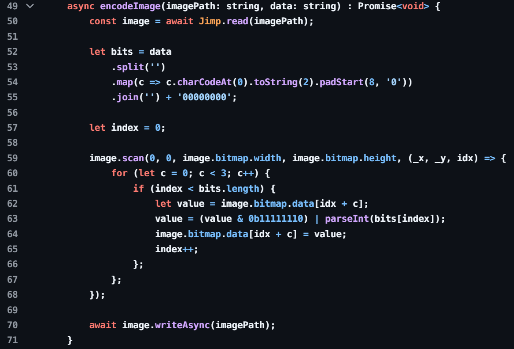

# Разбор уязвимостей сервиса SibirCTF

Всем привет!

На **SibirCTF** вам удалось порешать сервис, разработанный нашей командой.  
Сервис представлял из себя **Биржу по покупке кибервалюты**, где можно было создавать, покупать и продавать продукты. 

В качестве секретной информации использовался контент в продукте, который сохранялся в закодированном виде. Чтобы просмотреть контент, нужно было владеть продуктом. То есть если продукт принадлежал вам, то происходило декодирование контента. 

Поэтому для получения флага можно было:
- накопить достаточно денег и купить продукт с флагом
- получить содержимое продукта с флагом через уязвимость контроля доступа
- декодировать значение контента, разобравшись с криптографией

Рассмотрим эти способы:

---

### 1. Накрутка баланса за счет нескольких аккаунтов

Чтобы получить флаг, можно было купить продукт с флагом. Чтобы накопить достаточно денег, можно было создать несколько пользователей и, покупая продукты одного пользователя, собирать у него деньги.

---

### 2. Уязвимость с нулевым балансом

Уязвимость позволяет бесплатно покупать продукт, если его цена равна остатку баланса. То есть если купить продукт на все деньги, то деньги не отнимутся. Это происходит из-за условия в функции `updateUser`, которое проверяет, нужно ли обновлять баланс:
```
if (param.balance) user.balance = param.balance;
```
Если после покупки обновленный баланс нулевой, то баланс юзера не обновляется. Таким образом, можно использовать две учетки для быстрой накрутки баланса, после чего купить продукт с флагом.

---

### 3. Цепочка уязвимостей: ReDoS → Race Condition

Самая интересная уязвимость — вы могли в коде увидеть регулярное выражение, которое должно было вас смутить и натолкнуть на мысль, что разработчики заложили в сервис **ReDoS**:
```
if (/^REASON: (([a-z])+.)+\s#([0-9])+$/.test(buyInfo.reason))
```
Регулярное выражение находилось в функции покупки продукта. Оно проверяло параметр `reason` в запросе на покупку. 

Если проверить его в специализированном сервисе, можно было сразу получить пэйлоад:


Внимательно изучив код, можно было заметить, что проверка наличия достаточных средств на балансе происходит до валидации `reason`. Однако обновление баланса юзера происходит после анализа регулярки:


Поэтому, если сначала отправить запрос, вызывающий DoS:


То во время обработки регулярки можно отправить еще несколько запросов на покупку продуктов, которые успешно выполнятся, потому что пройдут проверку условия `(user.balance < product.price)`:


Например, у юзера было на балансе 300$:


И есть два продукта в магазине:


Выполнив последовательность запросов, описанную выше, юзер получит оба продукта на аккаунт, заплатив только за один:


---

### 4. Незащищенная база данных

База данных торчит наружу:


Достаточно подключиться к ней и изменить `ownerId` продукта с флагом на свой, или пополнить баланс своего пользователя, чтобы купить нужный продукт, или снизить цену на продукт с флагом - да что угодно!


---

### 5. Уязвимость отсутствия контроля доступа в WS

Если обратить внимание, как приложение получает данные о продуктах, то можно заметить определенный WS-запрос:


Запрос содержит json `{"uid":1,"pid":null}`. Изучив его внимательно, становится понятно, что параметр `uid` отвечает за идентификатор юзера, а параметр `pid` - за идентификатор продукта. Если передать `"pid":null`, то возвращаются все продукты.

При этом в декодированном виде приходит контент тех продуктов, идентификатор владельца которых передан в `uid` в запросе. Таким образом, можно отправить повторный запрос с `uid` владельца продукта с флагом и в ответе получить декодированный контент:   


---

### 6. Фейковая криптография и обфускация

Если внимательно прочитать код сервиса, можно заметить, что криптография, которой шифровались данные сервиса — на самом деле **и не криптография вовсе**:  


Наверное, вас должна была напугать обфускация программного кода, но на самом деле, так как это **TypeScript**, можно было легко декодировать данные, просто перенеся код из функции `verifyContent` в сплойт или исполнив его в интерпретаторе TS:


---

### 7. Скрытый флаг внутри изображения

Если вы обратите внимание на алгоритм генерации картинки, то заметите, что он прячет внутри изображения флаг:



Чтобы достать флаг обратно, давайте попросим нейросеть написать декодирующую функцию:


После чего загрузим картинку и запустим скрипт:

```
$ pip install pillow
$ python decode.py
Decoded message: secret
```

Скрипт прикреплен `writeup/decode.py`

---

### 8. Известный secret для генерации JWT
В .env проекта по умолчанию прописан `SESSION_SECRET`, который является секретом для генерации пользовательских jwt.

Достаточно было изменить `id` и `username` в jwt на любого другого пользователя, подписав токен известным секретом. С получившимся токеном можно было покупать и создавать продукты от имени другого пользователя, видеть в открытом виде его флаг.
